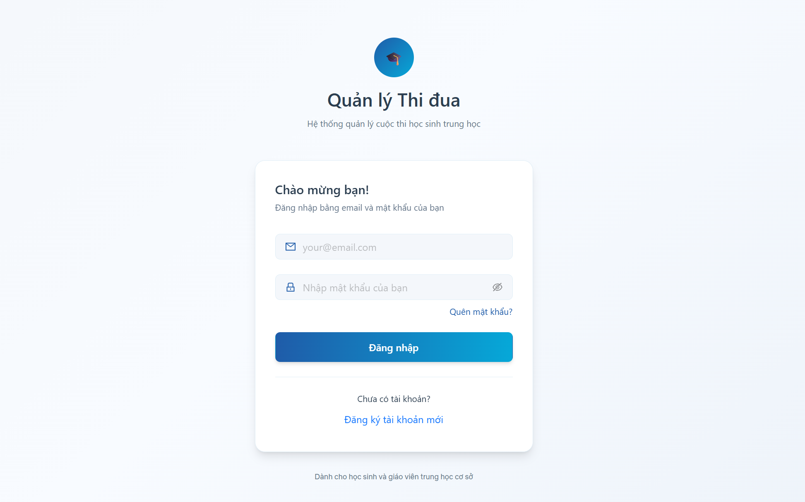

<p>&nbsp;</p>
<p align="center">
  
<p />

<p align="center">
  
  
</p>

<p align="center">
  <b>Buid With</b>
</p>

<p align="center">
  
  
  
  
  
  
  
  
  
</p>

<p align="center">⭐ Star me on GitHub — your support motivates me a lot! (´▽`ʃ♡ƪ)</p>

---

## ➡️ [Demo Here](app-quan-ly-thi-dua.vercel.app/)

## 📌 Table of Contents
* [💫 About CMS](#about)
* [✨ Features](#feature)
  * [🎯 Core Features](#core-features)
  * [💬 Communications & Real-Time Engagement](#communications--real-time-engagement)
  * [🤖 AI-Powered Capabilities](#ai-powered-capabilities)
  * [📁 Data Management & Reporting](#data-management--reporting)
* [📦 Installation & Setup](#setup)
  * [📋 Prerequisites](#prer)
  * [📥 Clone the Repository](#clone-the-repository)
  * [📝 Configuration (.env)](#configuration-env)
  * [🎉 Result](#result)
* [✍️ Author](#author)
* [📜 License](#license)
* [💖 Feedback & Support](#feedback)

## <a id="about"></a>💫 About CMS
<p>
  <strong>Competition Management Student (CMS)</strong> is an innovative, digital-first platform engineered to modernize and automate the evaluation and ranking processes for classrooms and students within Vietnamese educational environments. The project focuses on transforming traditional, paper-based assessment methods into a streamlined, data-driven ecosystem. By establishing a centralized management hub, CMS effectively minimizes manual workloads, mitigates administrative errors, and fosters a transparent, motivating atmosphere that drives academic excellence and collective growth.
</p>

<p>
  The application overcomes the constraints of legacy tracking systems by delivering an integrated graphical interface that processes real-time performance indicators and behavioral metrics. Schools and educators can seamlessly initialize customized grading rubrics, manage academic competitions, and generate instantaneous, structured rankings without the risk of calculation discrepancies. Currently in active development, CMS is continuously expanding its features to integrate advanced predictive analytics and broader cross-platform capabilities, making it a definitive tool for modernizing institutional governance in Vietnam.
</p>

## <a id="feature"></a> ✨ Features

### <a id="core-features"></a> 🎯 CORE FEATURES
**1. 🏢 Multi-Tenant Architecture (Multi-Organization)**
- Absolute Data Isolation: Supports multiple schools/organizations on a single platform with strict, secure data segregation between each tenant.
- Smart Member Onboarding: Seamless organization onboarding via unique Invite Codes, featuring configurable membership approval workflows (Automatic or Manual).
- 4-Tier Role-Based Access Control (RBAC): Granular permission system tailored for four distinct roles: Admin, Teacher, Student, and Red Flag (Student Inspectors).

**2. 📊 Automated Evaluation & Real-Time Scoring**
- **Flexible Rule Engine:** Dynamically automates merits and demerits for both classrooms and individual students based on fully customizable grading rubrics.
- **Transparent Appeal System:** A dedicated feedback module allows students to contest scores, processing appeals through three clear states: Pending, Approved, or Rejected.
- **Live Synchronization:** All discipline scores and evaluation progress are updated instantly across the entire platform.

**3. 🏆 Leaderboards & Recognition**
- **Automated Rankings:** Real-time calculation and generation of competitive leaderboards for both individuals and classrooms over weekly, monthly, or term-based periods.
- **Data Visualization:** Interactive charts offer instant, visual performance comparisons between different classrooms.
- **Red Flag Honors:** A recognition mechanism dedicated to highlighting and praising outstanding achievements to drive collective motivation.

### <a id="communications--real-time-engagement"></a> 💬 COMMUNICATIONS & REAL-TIME ENGAGEMENT
- **Real-Time Messaging & Feeds:** Instant chat capabilities supporting rich-media attachments. Features an intuitive 5-second message recall (unsend) option with an undo safety net.
- **Integrated WebRTC Calling:** Low-latency, peer-to-peer audio and video calling directly within the platform, complete with real-time call state management (Requesting, Accepted, Rejected, Ended).

### <a id="ai-powered-capabilities"></a> 🤖 AI-POWERED CAPABILITIES
- **Context-Aware AI Assistant:** Integrated with Google Gemini, utilizing advanced context injection to feed real-time system data directly into the AI model.

- **Multi-Purpose Support Chatbot:** Instantly analyzes evaluation data, looks up student/class insights, clarifies school regulations, and provides onboarding guidance. Answers are tailored to be concise, friendly, and appropriate for both educators and students.

### <a id="data-management--reporting"></a> 📁 DATA MANAGEMENT & REPORTING
- **Comprehensive Entity Governance:** Seamless, centralized management workflows for Students, Classrooms (including Form Teacher assignments), Faculty, Evaluation Forms, and Global Organization Settings.
- **One-Click Data Export:** Easily exports performance reports and leaderboard data into standardized spreadsheet formats, fully optimized for institutional reporting and administrative archives.
- **Real-time Contextual QA:** Features an intelligent chatbot powered by Modal Gemini, leveraging In-Context Learning and Context Injection techniques. The system automatically bundles the current graph structure data from the client-side with pre-defined system prompts from the backend to optimize AI responses. This enables the chatbot to provide highly accurate answers, ranging from software user guides and graph theory concepts to real-time analysis of the user's current graph topology.
</p>

## <a id="setup"></a> 📦 Installation & Setup

Follow these instructions to get a copy of the project up and running on your local machine for development and testing purposes.

### <a id="prer"></a> 📋 Prerequisites
Before you begin, ensure you have the following installed:
* [Git](https://git-scm.com/)
* [Node.js](https://nodejs.org/) (v18.0.0 or higher recommended) & (npm/bun)

### <a id="clone-the-repository"></a> 📥 Clone the Repository
```bash
git clone git@github.com:lhnhidev/competition-management-student.git
```

**1. 📝 Frontend Configuration (Frontend/.env)**
Create a `.env` file in the `Frontend` directory with the following content:
```bash
VITE_SERVER_URL=http://localhost:5000
```

**2. Backend Configuration (Backend/.env)**
Create a `.env` file in the `Backend` directory with the following content:
```bash
MONGO_URI=<your_mongo_uri>
appName=app-thi-dua
DNS_SERVERS=8.8.8.8,1.1.1.1

# Auth
JWT_SECRET=<your_password_jwt>

# AI
GEMINI_API_KEY=<your_gemini_api_key>

# Cloudinary (avatar upload)
CLOUDINARY_CLOUD_NAME=your_cloud_name_here
CLOUDINARY_API_KEY=your_api_key_here
CLOUDINARY_API_SECRET=your_api_secret_here

CLOUDINARY_AVATAR_FOLDER=cms_avatars
CLOUDINARY_CHAT_FOLDER=cms_chat_media

SMTP_HOST=smtp.gmail.com
SMTP_PORT=465
SMTP_USER=your_gmail
SMTP_PASS=your_gmail_app_password_here
MAIL_FROM=your_gmail
SMTP_FORCE_IPV4=true

RESEND_API_KEY=your_resend_api_key_here

SENDGRID_API_KEY=your_sendgrid_api_key_here
SENDGRID_FROM=your_gmail
```

You can use `bun` rather than `npm` to run the project.

**3. Install dependencies for both the frontend and backend**
```bash
# Install dependencies for Frontend
cd ./Frontend
bun install

# Install dependencies for Backend
cd ../Backend
bun install
```

**4. Start the development servers:**
``` bash
# Start for Frontend
# Via the local URL provided in your terminal http://localhost:5173
cd ../Frontend
bun run dev

# Start for Backend
# The API gateway will securely spin up at http://localhost:5000
cd ../Backend
bun run dev
```

### <a id="result"></a>  🎉 Result

After access http://localhost:5173. If configured successfully, after about 1-3 minutes, you will see an interface like this:



## <a id="author"></a> ✍️ Author


Le Hoang Nhi - Initial work & Lead Developer - @lhnhidev

You can also connect with me via [LinkedIn](https://www.linkedin.com/in/nhi-l%C3%AA-021188324/) or lhnhi420@gmail.com

## <a id="license"></a>  📜 License
Distributed under the MIT License. See [LICENSE](./LICENSE) file in the repository for more information.

## <a id="feedback"></a> 💖 Feedback & Support

If you love using CMS, please consider giving me a star on GitHub! ⭐

- Found a bug? Open an Issue on my repository.

- Have a feature request? I would love to hear it! Start a Discussion or drop an issue.

- Want to contribute? I welcome PRs!

---

<div align="center">
  
</div>

<p align="center">✨ Your feedback and stars help keep this project growing ✨</p>